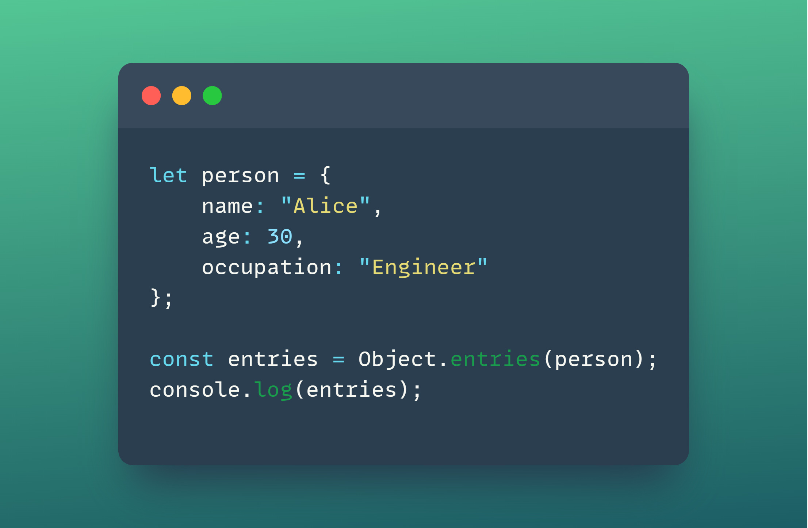
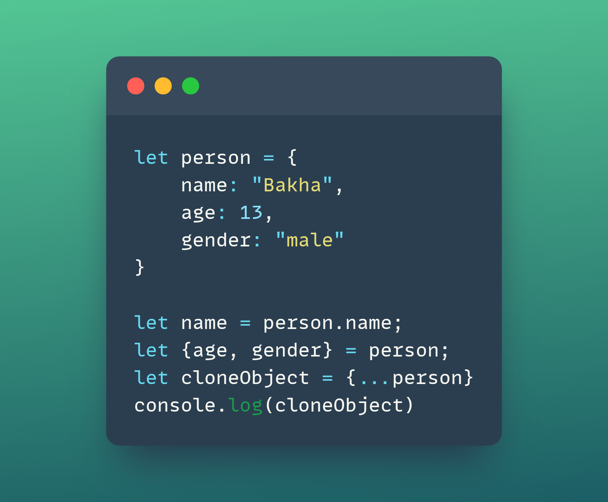

---
## Table of contents
1. Object
2. Methods of object
2. Destructuring
3. This
---
# What is object in JS ?
---
## In JavaScript, an object is a complex data structure that allows you to store collections of key-value pairs. Each key is a string (or Symbol), and each value can be of any data type, including numbers, strings, arrays, functions, or even other objects.
---
### Create an object:

---
# In JS we have three method of object:
1. Object.entries( ) - is a method that returns an array of a given object's own enumerable string-keyed property [key, value] pairs. This can be very useful for iterating over objects or converting them into other data structures.

2. Object.keys( ) - is a method that returns an array of a given object's own enumerable property names (keys). This is useful for iterating over the properties of an object or for performing operations based on the keys.

3. Object.values( ) - is a method that returns an array of a given object's own enumerable property values. This is useful for retrieving all the values stored in an object without needing to access them by their keys.

---
# The destructuring assignment syntax is a JavaScript expression that makes it possible to unpack properties from object, into distinct variables.

---
